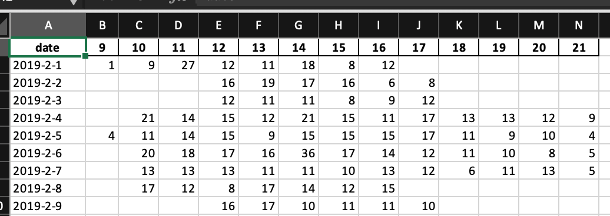

# SP Ask Running Total Daily report
An helper that create and Excel document representing the number of chats per day. Which are on the Daily Spreadsheet

### Installation

    $ pip install sp_ask_running_total_daily_report
    $ or with poetry
    $ poetry add sp_ask_running_total_daily_report

### Utilisation
```python
from sp_ask_running_total_daily_report import create_report

# generating stats for a given month (february)
create_report(2019, 2)

#generating stats for all months
for month_number in range(1, 13):
    create_report(2019, month_number)
```
Will create a file **'2-February.xlsx'** on the current directory

### Screenshot
This is a screenshot. We don't provide our daily stats to the public. The number below were updated to fake our real numbers.



### Todo
1.  Test
2.  Refactor
3.  Add docstring
4.  Add a Makefile
5.  Add show terminal graph for a given month
6.  Create a .rst file and add metadata for 
